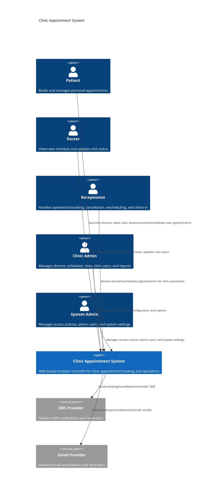

# C4 Model - Level 1: System Context

## Notes

- `System Admin` در MVP یک actor فنی/امنیتی است و actor روزمره کسب‌وکاری برای booking محسوب نمی‌شود.
- `SMS Provider` و `Email Provider` تنها external systemهای قطعی در baseline فعلی هستند.
- `Payment Gateway` در MVP خارج از محدوده است و در system context نمایش داده نمی‌شود.