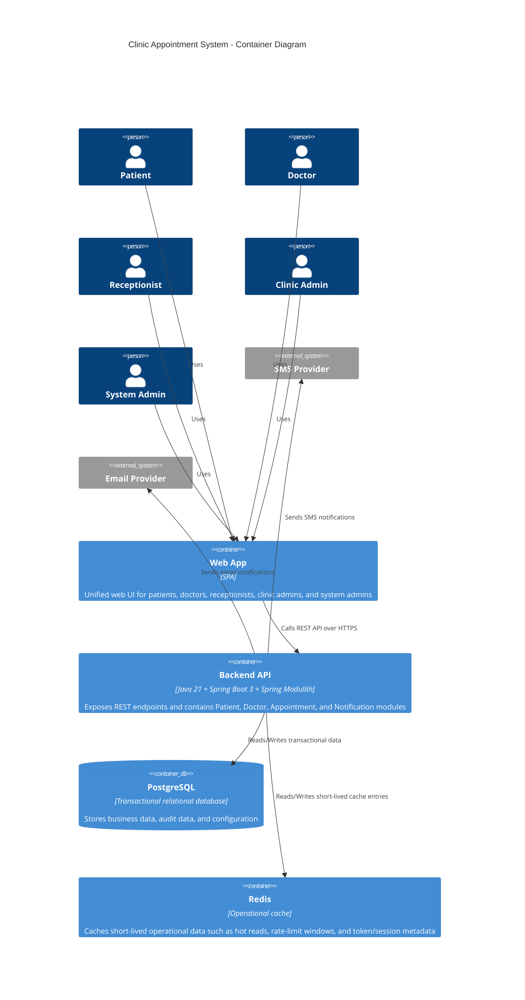

## Notes

- `Payment Gateway` از container diagram حذف شده چون در MVP خارج از scope است.
- `Redis` در baseline فعلی منبع حقیقت رزرو نیست و فقط برای cache عملیاتی استفاده می‌شود.
- پردازش‌های async مانند reminder/notification داخل همان `Backend API` (runtime مشترک Modular Monolith) اجرا می‌شوند و در MVP به worker مستقل Node.js نیاز نداریم.
- invariantهای جلوگیری از double booking در لایه `Backend API` و پایگاه داده تراکنشی enforce می‌شوند.