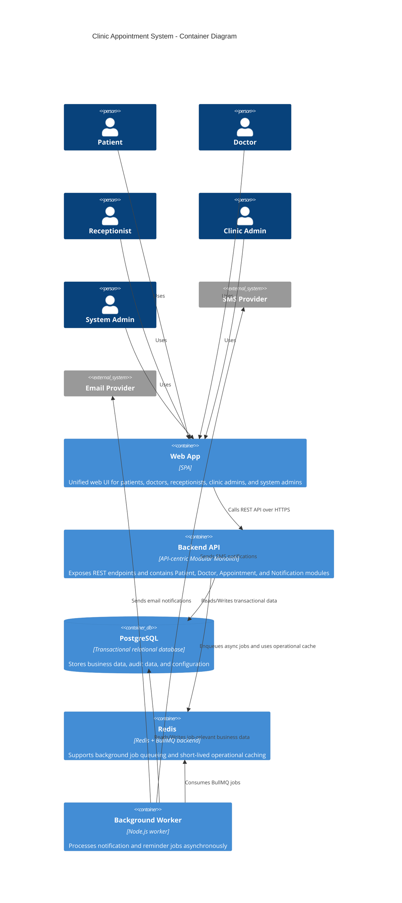

## Notes

- `Payment Gateway` از container diagram حذف شده چون در MVP خارج از scope است.
- `Redis` در baseline فعلی منبع حقیقت رزرو نیست و به‌عنوان queue backend / cache عملیاتی مدل شده است.
- invariantهای جلوگیری از double booking در لایه `Backend API` و پایگاه داده تراکنشی enforce می‌شوند.