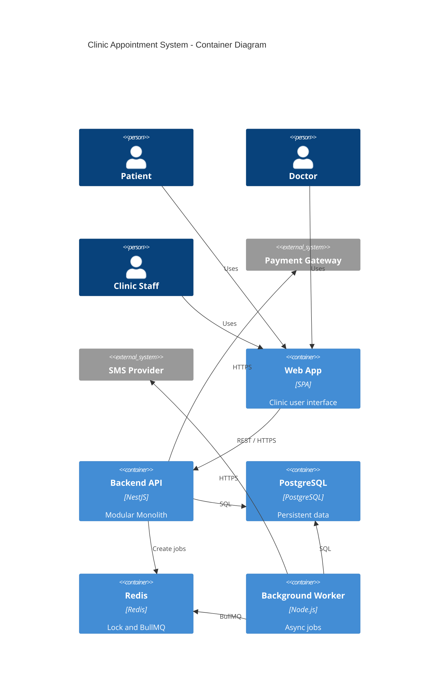

```mermaid

C4Container
title Clinic Appointment System - Container Diagram

Person(patient, "Patient")
Person(doctor, "Doctor")
Person(staff, "Clinic Staff")

System_Ext(payment, "Payment Gateway")
System_Ext(sms, "SMS Provider")

Container(web, "Web App", "SPA", "Clinic user interface")
Container(api, "Backend API", "NestJS", "Modular Monolith")
Container(db, "PostgreSQL", "PostgreSQL", "Persistent data")
Container(redis, "Redis", "Redis", "Lock and BullMQ")
Container(worker, "Background Worker", "Node.js", "Async jobs")

Rel(patient, web, "Uses")
Rel(doctor, web, "Uses")
Rel(staff, web, "Uses")

Rel(web, api, "REST / HTTPS")

Rel(api, db, "SQL")
Rel(api, redis, "Redis Protocol")

Rel(api, payment, "HTTPS")
Rel(api, redis, "Create jobs")

Rel(worker, redis, "BullMQ")
Rel(worker, db, "SQL")
Rel(worker, sms, "HTTPS")
```