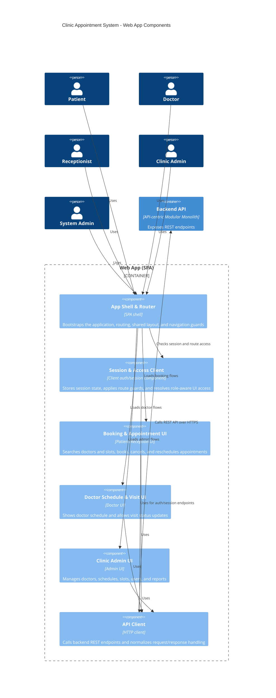

# C4 Model - Level 3: Web App Components

## Components

| Component | Responsibility |
| --- | --- |
| `App Shell & Router` | route composition, layout, navigation, guarded sections |
| `Session & Access Client` | login state, session refresh, logout, client-side role-aware access |
| `Booking & Appointment UI` | patient/reception workflows for search, booking, cancellation, reschedule |
| `Doctor Schedule & Visit UI` | doctor workflows for schedule visibility and visit-state updates |
| `Clinic Admin UI` | doctor/schedule/slot/user/report management |
| `API Client` | common HTTP transport, error mapping, request metadata |

## Notes

- UI-level access control صرفاً برای UX و navigation guard است؛ enforcement نهایی باید در `Backend API` انجام شود.
- `Booking & Appointment UI` هم برای `Patient` و هم برای `Receptionist` استفاده می‌شود، اما capabilityهای قابل‌نمایش بر اساس نقش محدود می‌شود.
- `System Admin` در UI فقط به بخش‌های فنی/امنیتی دسترسی دارد، نه جریان‌های روزمره booking.
