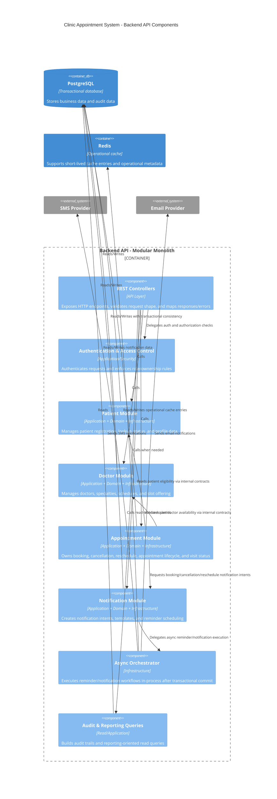

# C4 Model - Level 3: Backend API Components

## Components

| Component | Responsibility |
| --- | --- |
| `REST Controllers` | request validation, endpoint mapping, response contracts, status/error translation |
| `Authentication & Access Control` | actor identity, role checks, ownership checks, security boundaries |
| `Patient Module` | patient profile and business identity ownership |
| `Doctor Module` | doctor, specialty, schedule, and slot ownership |
| `Appointment Module` | booking core, cancellation, reschedule, lifecycle and visit tracking |
| `Notification Module` | notification intent creation, reminder orchestration, delivery preparation |
| `Async Orchestrator` | اجرای async داخلی پس از commit تراکنش و هماهنگی ارسال اعلان |
| `Audit & Reporting Queries` | read models and audit-oriented projections |

## Dependency Rules

- `REST Controllers` به domain داخلی مستقیم متصل نمی‌شوند و فقط از application-facing contracts استفاده می‌کنند.
- `Appointment Module` تنها ماژولی است که outcome نهایی booking را تعیین می‌کند.
- `Doctor Module` منبع حقیقت `Slot` و availability است.
- `Notification Module` downstream است و rule تصمیم‌گیری رزرو را در خود تکرار نمی‌کند.
- `Async Orchestrator` بعد از موفقیت عملیات دامنه فراخوانی می‌شود و نباید موفقیت تراکنش رزرو را قبل از commit نهایی اعلام کند.

## Notes

- invariantهای ضد `double booking` در این container و persistence layer enforce می‌شوند.
- `Redis` lock authority نیست و منبع حقیقت رزرو محسوب نمی‌شود.
- اگر در آینده decomposition رسمی لایه‌ها انجام شود، هر module باید به زیرلایه‌های `API`, `Application`, `Domain`, `Infrastructure` شکسته شود بدون شکستن مرز bounded contextها.
