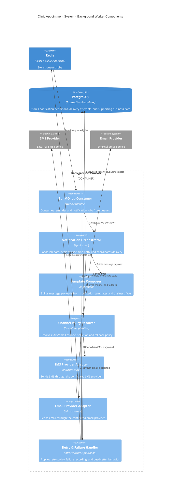

# C4 Model - Level 3: Background Worker Components

## Components

| Component | Responsibility |
| --- | --- |
| `BullMQ Job Consumer` | receives async jobs from queue |
| `Notification Orchestrator` | central execution path for notification and reminder jobs |
| `Template Composer` | transforms template + data into final message payload |
| `Channel Policy Resolver` | applies channel selection and fallback decisions |
| `SMS Provider Adapter` | isolated adapter for SMS integration |
| `Email Provider Adapter` | isolated adapter for email integration |
| `Retry & Failure Handler` | retry scheduling, failure persistence, and operational safety |

## Notes

- worker درباره valid بودن رزرو تصمیم نمی‌گیرد؛ فقط event/job معتبر را پردازش می‌کند.
- failure در ارسال اعلان نباید integrity رزرو را بر هم بزند، اما باید traceable و retryable باشد.
- policyهای دقیق retry/timeout/fallback هنوز در checklist بخش integration باقی مانده‌اند و بعداً باید روی این Level 3 sync شوند.
