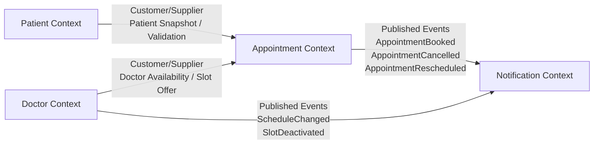

# Context Map

## هدف

این سند مرز bounded contextهای اصلی سامانه نوبت‌دهی کلینیک، نوع رابطه بین آن‌ها و الگوی تعامل پیشنهادی در معماری modular monolith را مشخص می‌کند.

---

## Bounded Contextهای اصلی

| Context | مسئولیت اصلی | Primary Business Owner | Primary Technical Owner |
| --- | --- | --- | --- |
| `Patient` | مدیریت هویت کسب‌وکاری بیمار، پروفایل بیمار و داده‌های قابل‌استفاده در رزرو | مدیریت کلینیک | تیم Backend |
| `Doctor` | مدیریت پزشک، تخصص، برنامه کاری، استثناهای کاری و عرضه Slot | مدیریت کلینیک | تیم Backend |
| `Appointment` | رزرو، لغو، جابه‌جایی، مشاهده و مدیریت lifecycle نوبت | عملیات پذیرش کلینیک | تیم Backend |
| `Notification` | تولید، زمان‌بندی و ارسال اعلان‌های رزرو، لغو و Reminder | مدیریت عملیات/پذیرش | تیم Backend |

---

## نوع Subdomain

| Context | نوع Subdomain | دلیل |
| --- | --- | --- |
| `Appointment` | Core | ارزش اصلی محصول روی رزرو صحیح، اتمیک و بدون double booking متمرکز است. |
| `Doctor` | Supporting | مدیریت ظرفیت و عرضه زمان رزرو را فراهم می‌کند اما خود مزیت رقابتی اصلی نیست. |
| `Patient` | Supporting | مدیریت بیمار برای عملیات رزرو ضروری است اما هسته تمایز محصول نیست. |
| `Notification` | Generic/Supporting | الگوهای رایج ارسال اعلان را پیاده می‌کند و باید از هسته رزرو جدا بماند. |

---

## Context Map در سطح مفهومی

---

## رابطه بین Contextها

### 1) `Patient` -> `Appointment`

- **Relationship Pattern:** Customer/Supplier
- **Upstream:** `Patient`
- **Downstream:** `Appointment`
- **Published Language:** `PatientId`, `PatientStatus`, `PatientContactInfo`, `PatientDisplayName`
- **قاعده تعامل:**
	- `Appointment` مالک پروفایل بیمار نیست.
	- `Appointment` فقط از شناسه و snapshot حداقلی بیمار برای رزرو و نمایش استفاده می‌کند.
	- حذف یا ویرایش پروفایل بیمار نباید تاریخچه نوبت را از بین ببرد.

### 2) `Doctor` -> `Appointment`

- **Relationship Pattern:** Customer/Supplier
- **Upstream:** `Doctor`
- **Downstream:** `Appointment`
- **Published Language:** `DoctorId`, `SpecialtyId`, `SlotId`, `ScheduleWindow`, `DoctorAvailability`
- **قاعده تعامل:**
	- `Doctor` عرضه‌کننده ظرفیت رزرو است.
	- `Appointment` نباید مدل داخلی schedule یا repository داخلی `Doctor` را مستقیم لمس کند.
	- رزرو فقط بر اساس Slotهای منتشرشده و معتبر انجام می‌شود.

### 3) `Appointment` -> `Notification`

- **Relationship Pattern:** Published Language / Event Notification
- **Upstream:** `Appointment`
- **Downstream:** `Notification`
- **Published Language:** `AppointmentBooked`, `AppointmentCancelled`, `AppointmentRescheduled`, `ReminderDue`
- **قاعده تعامل:**
	- `Notification` درباره قوانین رزرو تصمیم نمی‌گیرد.
	- `Notification` صرفاً بر مبنای event یا command معتبر، پیام مناسب را تولید و ارسال می‌کند.

### 4) `Doctor` -> `Notification`

- **Relationship Pattern:** Published Language
- **Upstream:** `Doctor`
- **Downstream:** `Notification`
- **Published Language:** `ScheduleChanged`, `SlotDeactivated`
- **قاعده تعامل:**
	- در صورت تغییر برنامه یا غیرفعال‌شدن Slot، `Notification` می‌تواند اعلان مناسب برای نوبت‌های درگیر ایجاد کند.

---

## Integration Rules

- هیچ contextی اجازه دسترسی مستقیم به entity یا repository داخلی context دیگر را ندارد.
- ارتباط بین contextها باید از طریق یکی از این الگوها انجام شود:
	- internal application service contract
	- query contract برای داده‌های read-only
	- domain event / integration event داخلی
- `Appointment` تنها contextی است که حق تصمیم‌گیری نهایی درباره موفق یا ناموفق بودن رزرو را دارد.
- `Doctor` تنها contextی است که حق تصمیم‌گیری درباره ظرفیت، برنامه کاری و عرضه Slot را دارد.
- `Patient` تنها contextی است که حق تصمیم‌گیری درباره وضعیت و اطلاعات پروفایل بیمار را دارد.
- `Notification` تنها contextی است که حق تصمیم‌گیری درباره template، channel selection و retry ارسال را دارد.

---

## Shared Kernel Policy

در baseline فعلی، **Shared Kernel توصیه نمی‌شود** مگر برای typeهای بسیار کوچک و پایدار مانند:

- `DoctorId`
- `PatientId`
- `AppointmentId`
- `SlotId`
- enumهای عمومی بسیار محدود

حتی این typeها نیز بهتر است در لایه contract یا packageهای مشترک بسیار کوچک و کنترل‌شده نگه‌داری شوند تا coupling افزایش پیدا نکند.

---

## Anti-Corruption Rules

- `Appointment` باید داده‌های `Doctor` و `Patient` را از طریق contractهای داخلی بگیرد، نه از مدل persistence آن‌ها.
- `Notification` باید eventهای کسب‌وکاری را به مدل پیام قابل ارسال ترجمه کند و از domain اصلی مستقل بماند.
- اگر در آینده `Identity/Access` به context جدا تبدیل شود، باید برای آن Anti-Corruption Layer مستقل در برابر `Patient` و `Clinic Admin` تعریف شود.

---

## Resulting Modular Boundaries

- `Patient Module`
- `Doctor Module`
- `Appointment Module`
- `Notification Module`

این چهار ماژول، baseline پیشنهادی برای شکستن modular monolith در فاز MVP هستند.
