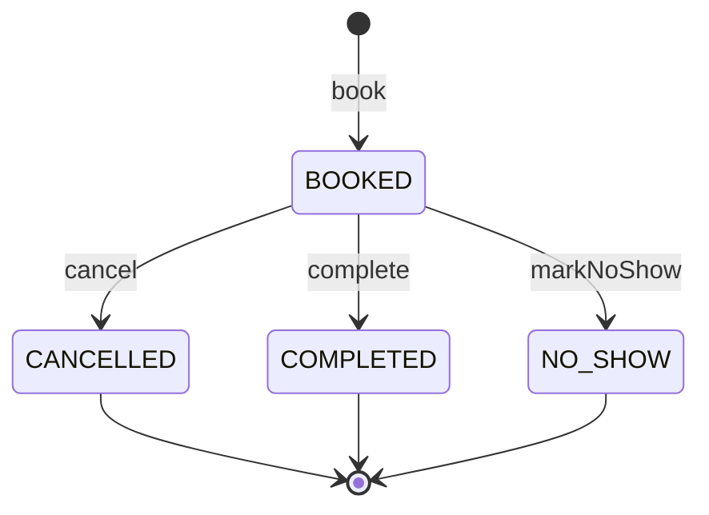
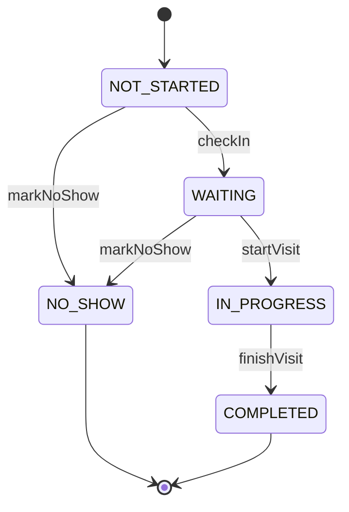
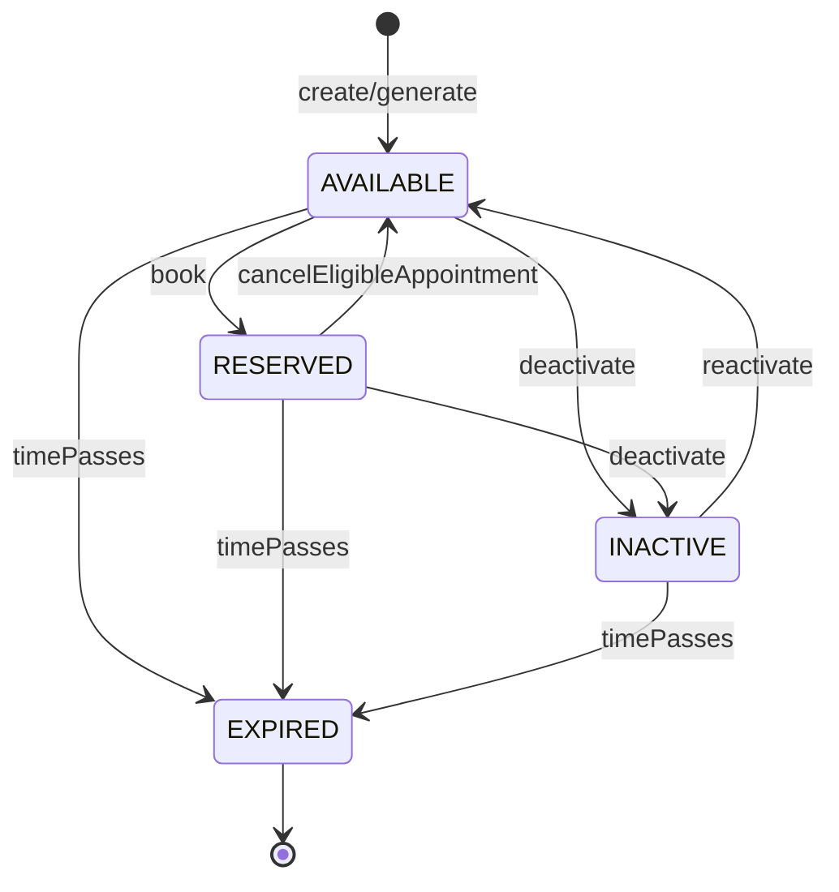

# State Machines

## هدف

این سند مدل وضعیت‌های اصلی دامنه را برای `Appointment`، `Visit` و `Slot` تعریف می‌کند تا در طراحی کد، API، تست و پایگاه داده یک تفسیر یکتا وجود داشته باشد.

---

## تصمیم پایه

در baseline فعلی:

- `Appointment Status` و `Visit Status` **دو مفهوم جدا** هستند.
- `Appointment Status` چرخه عمر رزرو را نشان می‌دهد.
- `Visit Status` وضعیت حضور/ارائه خدمت در زمان مراجعه را نشان می‌دهد.
- `Slot Status` وضعیت عرضه ظرفیت رزرو را نشان می‌دهد.

---

## 1) Appointment State Machine

### Statuses

| Status | Meaning | Terminal |
| --- | --- | --- |
| `BOOKED` | نوبت با موفقیت رزرو شده و هنوز خاتمه نیافته است | خیر |
| `CANCELLED` | نوبت لغو شده است | بله |
| `COMPLETED` | خدمت مرتبط با نوبت انجام شده است | بله |
| `NO_SHOW` | بیمار در زمان مراجعه حضور پیدا نکرده است | بله |

> `CONFIRMED` در baseline فعلی جزو وضعیت‌های MVP نیست و برای نسخه‌های آینده رزرو شده است.

### Diagram

### Transition Table

| From | To | Trigger | Allowed Actors | Guards |
| --- | --- | --- | --- | --- |
| none | `BOOKED` | `BookAppointment` | `Patient`, `Receptionist`, `Clinic Admin` | Patient معتبر؛ Doctor فعال؛ Slot موجود، فعال و آینده؛ Slot بدون Appointment فعال؛ بیمار برای همان Doctor در همان روز Appointment فعال دیگری نداشته باشد |
| `BOOKED` | `CANCELLED` | `CancelAppointment` | `Patient`, `Receptionist`, `Clinic Admin`, system flow | اگر actor بیمار است: حداقل ۲ ساعت تا `scheduledStart` باقی مانده باشد؛ اگر actor داخلی است override مجاز است |
| `BOOKED` | `COMPLETED` | `MarkAppointmentCompleted` | `Doctor`, `Receptionist`, `Clinic Admin` | زمان مراجعه رسیده یا گذشته باشد؛ Appointment لغوشده نباشد |
| `BOOKED` | `NO_SHOW` | `MarkAppointmentNoShow` | `Doctor`, `Receptionist`, `Clinic Admin` | زمان مراجعه رسیده یا گذشته باشد؛ Appointment لغوشده نباشد |

### Invalid Transitions

- `CANCELLED -> BOOKED`
- `CANCELLED -> COMPLETED`
- `CANCELLED -> NO_SHOW`
- `COMPLETED -> *`
- `NO_SHOW -> *`

---

## 2) Visit State Machine

### Statuses

| Status | Meaning | Terminal |
| --- | --- | --- |
| `NOT_STARTED` | مراجعه هنوز آغاز نشده است | خیر |
| `WAITING` | بیمار پذیرش شده و منتظر خدمت است | خیر |
| `IN_PROGRESS` | خدمت‌دهی شروع شده است | خیر |
| `COMPLETED` | فرآیند مراجعه/خدمت پایان یافته است | بله |
| `NO_SHOW` | بیمار در بازه مجاز مراجعه نکرده است | بله |

### Diagram

### Transition Table

| From | To | Trigger | Allowed Actors | Guards |
| --- | --- | --- | --- | --- |
| none | `NOT_STARTED` | Appointment created | system | همزمان با ایجاد Appointment |
| `NOT_STARTED` | `WAITING` | `MarkVisitWaiting` / check-in | `Receptionist`, `Doctor`, `Clinic Admin` | Appointment در وضعیت `BOOKED` باشد |
| `WAITING` | `IN_PROGRESS` | `MarkVisitInProgress` | `Doctor`, `Receptionist`, `Clinic Admin` | Appointment در وضعیت `BOOKED` باشد |
| `IN_PROGRESS` | `COMPLETED` | `MarkAppointmentCompleted` | `Doctor`, `Receptionist`, `Clinic Admin` | خدمت واقعاً پایان یافته باشد |
| `NOT_STARTED` | `NO_SHOW` | `MarkAppointmentNoShow` | `Doctor`, `Receptionist`, `Clinic Admin`, scheduled system job | زمان مراجعه گذشته باشد و بیمار check-in نشده باشد |
| `WAITING` | `NO_SHOW` | `MarkAppointmentNoShow` | `Doctor`, `Receptionist`, `Clinic Admin` | سیاست کلینیک اجازه دهد |

### Cross-State Rules

- وقتی `Visit Status = COMPLETED` می‌شود، `Appointment Status` نیز باید `COMPLETED` شود.
- وقتی `Visit Status = NO_SHOW` می‌شود، `Appointment Status` نیز باید `NO_SHOW` شود.
- برای `Appointment Status = CANCELLED`، `Visit Status` نباید از `NOT_STARTED` جلوتر برود.

---

## 3) Slot State Machine

### Statuses

| Status | Meaning | Terminal |
| --- | --- | --- |
| `AVAILABLE` | Slot قابل رزرو و عرضه به کاربران است | خیر |
| `RESERVED` | Slot به‌واسطه وجود یک Appointment فعال دیگر قابل رزرو نیست | خیر |
| `INACTIVE` | Slot به‌صورت دستی یا سیستمی از عرضه خارج شده است | خیر |
| `EXPIRED` | زمان شروع Slot گذشته است و دیگر قابل عرضه نیست | بله |

### Diagram

### Transition Table

| From | To | Trigger | Allowed Actors | Guards |
| --- | --- | --- | --- | --- |
| none | `AVAILABLE` | `CreateSlot` / `GenerateSlots` | `Clinic Admin`, authorized `Doctor`, system | Doctor فعال باشد؛ بازه هم‌پوشان نباشد؛ زمان در آینده باشد |
| `AVAILABLE` | `RESERVED` | successful booking | system | Appointment فعال روی Slot ایجاد شده باشد |
| `AVAILABLE` | `INACTIVE` | `DeactivateSlot` | `Clinic Admin`, authorized `Doctor` | سیاست کلینیک اجازه دهد |
| `AVAILABLE` | `EXPIRED` | time passes | system | `scheduledStart <= now` |
| `RESERVED` | `AVAILABLE` | eligible cancellation/reschedule | system | Appointment فعال قبلی دیگر وجود نداشته باشد؛ Slot آینده باشد؛ Slot فعال باشد؛ Doctor فعال باشد |
| `RESERVED` | `INACTIVE` | `DeactivateSlot` | `Clinic Admin`, authorized `Doctor` | حتی اگر Appointment وجود داشته باشد، از رزرو جدید خارج می‌شود |
| `RESERVED` | `EXPIRED` | time passes | system | `scheduledStart <= now` |
| `INACTIVE` | `AVAILABLE` | `ReactivateSlot` | `Clinic Admin`, authorized `Doctor` | Slot آینده باشد؛ Doctor فعال باشد؛ Appointment فعال نداشته باشد |
| `INACTIVE` | `EXPIRED` | time passes | system | `scheduledStart <= now` |

### Invalid Transitions

- `EXPIRED -> AVAILABLE`
- `EXPIRED -> RESERVED`
- `RESERVED -> AVAILABLE` وقتی Appointment فعال هنوز وجود دارد
- `INACTIVE -> AVAILABLE` وقتی Slot گذشته است یا Doctor غیرفعال است

---

## 4) Derived Consistency Rules

- `Slot Status = RESERVED` اگر و فقط اگر برای آن Slot یک `Appointment` فعال وجود داشته باشد.
- `Slot Status = AVAILABLE` فقط وقتی معتبر است که:
  - Slot فعال باشد
  - Slot آینده باشد
  - Doctor فعال باشد
  - Appointment فعال برای Slot وجود نداشته باشد
- `Appointment Status = CANCELLED` به‌تنهایی تضمین نمی‌کند که Slot دوباره `AVAILABLE` شود؛ guardهای Slot نیز باید برقرار باشند.

---

## 5) Implementation Notes for Source Generation

- `Appointment Status` و `Visit Status` باید در مدل کد و پایگاه داده به‌صورت جداگانه ذخیره شوند.
- `Slot Status` می‌تواند persisted یا partially derived باشد، اما رفتار observable آن باید مطابق جدول بالا باشد.
- actor authorization برای transitionها باید در application layer enforce شود.
- guardها باید هم در application logic و هم در تست‌های acceptance پوشش داده شوند.